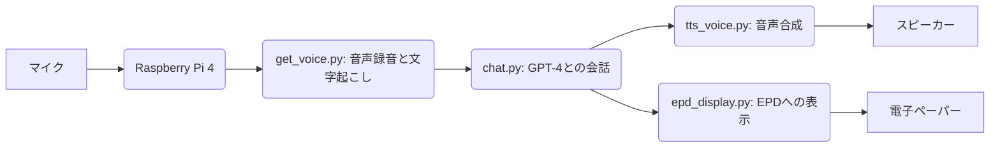

# auto_speaker

このプロジェクトは、以下の機能を備えた自動スピーカーシステムである。

*   音声を録音
*   Whisperを用いてテキストに変換
*   GPT-4にテキストを問い合わせ
*   EPDにレスポンスを表示
*   テキスト読み上げAPIを用いてレスポンスを読み上げ

## 説明

このプロジェクトには、以下のコンポーネントが含まれている。

- `main.py`: アプリケーションのメインエントリーポイントである。音声を録音し、テキストに変換し、GPT-4に問い合わせ、EPDにレスポンスを表示し、テキスト読み上げAPIを用いてレスポンスを読み上げるプロセス全体を調整する。
- `api`: OpenAIのGPT-4およびTTSサービスとやり取りするためのAPIエンドポイントが含まれている。
    - `chat.py`: OpenAI GPT-4 APIとの通信を処理する。テキストプロンプトを入力として受け取り、GPT-4からのレスポンスを返す。また、その後のクエリのコンテキストを提供するために、会話履歴を保持する。ペルソナは、知識が豊富で、親しみやすく、親切な大阪在住の女性であり、大阪弁で応答する。
    - `tts_voice.py`: OpenAI TTS APIを使用して、テキストを音声に変換する。テキスト文字列を入力として受け取り、音声ファイルを生成し、ユーザーに再生する。
- `display`: EPD（電子ペーパーディスプレイ）へのテキスト表示を管理する。
    - `epd_display.py`: EPDにテキストを表示するための関数が含まれている。表示に合わせてテキストを折り返し、日本語の文字を適切にレンダリングするために日本語フォントを使用する。
- `voice`: 音声の録音と文字起こしを処理する。
    - `get_voice.py`: マイクから音声を録音し、音声の開始と終了を検出し、Whisperを使用して音声をテキストに変換する。しきい値を使用して音声の開始と終了を判断し、録音された音声をWAVファイルに保存する。次に、subprocessを使用してWhisper CLIを実行し、音声をテキストに変換する。

## システムフローチャート

各pyファイルの機能と実行方法:

- `main.py`:
    - 機能: 音声録音、文字起こし、GPT-4との会話、音声合成、EPD表示を連携させるメイン処理。
    - 実行方法: `python main.py`
- `api/chat.py`:
    - 機能: OpenAI GPT-4 APIとの会話を行う。
    - 実行方法: 単独で実行可能だが、`main.py`から呼び出されることを想定。
- `api/tts_voice.py`:
    - 機能: OpenAI TTS APIを用いてテキストを音声に変換する。
    - 実行方法: 単独で実行可能だが、`main.py`から呼び出されることを想定。
- `display/epd_display.py`:
    - 機能: EPDにテキストを表示する。
    - 実行方法: 単独で実行可能だが、`main.py`から呼び出されることを想定。
- `voice/get_voice.py`:
    - 機能: 音声を録音し、Whisperを用いてテキストに変換する。
    - 実行方法: 単独で実行可能だが、`main.py`から呼び出されることを想定。

## 実行環境とバージョン

*   OS: Linux raspberrypi 6.6.74+rpt-rpi-v8 #1 SMP PREEMPT Debian 1:6.6.74-1+rpt1 (2025-01-27) aarch64 GNU/Linux
*   Python: 3.11.2

## 依存関係

- `openai` (1.65.4): GPT-4およびTTSサービスにアクセスするためのOpenAI APIクライアント。
- `sounddevice` (0.5.1): マイクから音声を録音するため。
- `numpy` (1.26.4): 数値データ処理のため。
- `wave`: 音声データをWAVファイルに保存するため。
- `subprocess`: Whisper CLIを実行するため。
- `requests` (2.32.3): OpenAI APIにHTTPリクエストを送信するため。
- `simpleaudio` (1.0.4): 音声ファイルを再生するため。
- `pydub` (0.25.1): MP3ファイルをWAVファイルに変換するため。
- `PIL (Pillow)` (10.3.0): 画像処理とEPDへのテキスト描画のため。
- `epd7in5_V2`: EPDを制御するためのライブラリ。

## 使い方

1. `OPENAI_API_KEY`環境変数をOpenAI APIキーに設定する。
2. Whisper CLIがインストールされ、正しく構成されていることを確認する。
3. `main.py`を実行して、自動スピーカーシステムを開始する。
