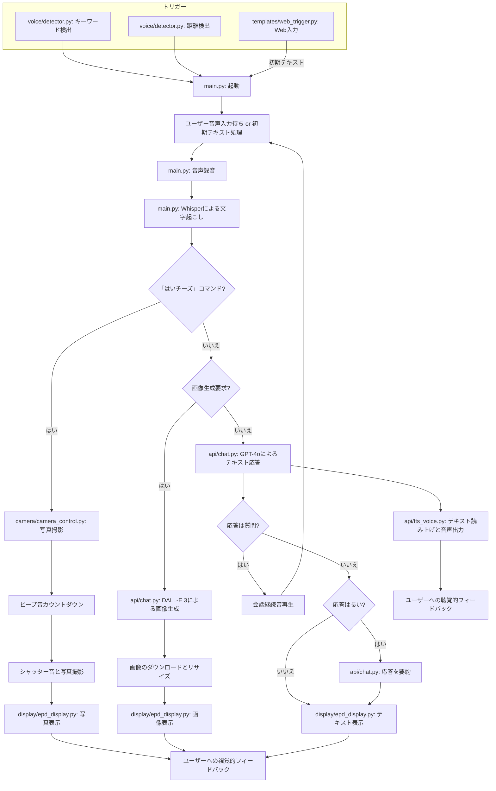

# auto_speaker

このプロジェクトは、Raspberry Piを使用した音声対話システムで、以下の機能を備えている。

*   音声を録音してOpenAI Whisper APIでテキストに変換
*   OpenAIのGPT-4を使用したテキスト応答生成
*   DALL-E 3による画像生成機能
*   電子ペーパーディスプレイ（EPD）への出力表示
*   テキスト読み上げAPIを用いた音声合成
*   生成画像の自動保存機能（入力文字列と日付情報をファイル名に使用）
*   「はいチーズ」音声コマンドによる写真撮影・表示機能
*   カウントダウンと撮影タイミングのビープ音フィードバック
*   **起動トリガー**:
    *   キーワード検出（例: "キカイ君"）による起動 (Picovoice Porcupine)
    *   超音波センサーによる近接検出からの自動起動
    *   Webインターフェースからの手動起動
*   **会話継続機能**: GPTの応答が質問の場合、続けて音声入力を待ち、会話を継続
*   **要約表示機能**: 会話終了時、最後の応答が長い場合に700文字以内に要約して表示
*   **タイムアウト処理**: 会話継続中の音声入力タイムアウト時、最後の応答を要約して表示

## システム概要

このシステムは、キーワード検出、近接検出、またはWebインターフェースからのトリガーで起動し、ユーザーの音声入力を受け取ります。その内容に基づいてテキスト応答や画像生成を行い、電子ペーパーディスプレイに表示すると同時に音声で読み上げる機能を持つ。特徴的なのは、応答が大阪弁のキャラクター（おばちゃん）として返されることである。

## プロジェクト構成

### ディレクトリ構造
```
auto_speaker/
├── api/                  # API関連のモジュール
│   ├── __init__.py
│   ├── chat.py           # OpenAI GPT/DALL-E APIとの通信
│   └── tts_voice.py      # テキスト読み上げ機能
├── camera/               # カメラ関連のモジュール
│   ├── __init__.py
│   └── camera_control.py # カメラ制御機能
├── display/              # ディスプレイ関連のモジュール
│   ├── __init__.py
│   ├── epd7in5_V2.py     # 7.5インチ電子ペーパー制御ライブラリ
│   ├── epd_display.py    # テキスト表示機能
│   └── epdconfig.py      # 電子ペーパー設定
├── voice/                # 音声処理関連のモジュール
│   ├── __init__.py
│   ├── detector.py       # キーワード検出＆距離検出による起動トリガー
│   └── get_voice.py      # (旧)音声録音と文字起こし -> main.pyに統合？
├── ultra_sonic/          # (旧)超音波センサー関連 -> voice/detector.py に統合
│   ├── __init__.py
│   └── distance.py       # (旧)距離測定スクリプト
├── templates/            # Web関連ファイル
│   ├── index.html        # (未使用？)
│   └── web_trigger.py    # Webインターフェースからの起動トリガー
├── models/               # モデルファイル
│   └── picovoice/        # Picovoice関連モデル
│       ├── kikaikun_ja_raspberry-pi_v3_0_0.ppn # キーワードモデル
│       └── porcupine_params_ja.pv              # 日本語モデルパラメータ
├── generated_images/     # 生成された画像の保存ディレクトリ
├── photos/               # 撮影された写真の保存ディレクトリ
├── sounds/               # 音声フィードバック用のサウンドファイル
├── __init__.py
├── main.py               # メインプログラム（音声処理、API連携、表示制御など）
├── epd_reset.py          # 電子ペーパーのリセット用スクリプト
└── README.md             # このファイル
```

### 主要コンポーネントの詳細

#### メインプログラム (`main.py`)
- システム全体の実行フローを制御（起動トリガーからの処理開始）
- 音声録音とWhisper APIによる文字起こし
- 各モジュールを連携させて、テキスト入力から応答出力までの一連の処理を実行
- 「はいチーズ」音声コマンドの検出と写真撮影機能の起動
- 画像生成要求とテキスト応答要求を適切に振り分け
- Webトリガーからの初期テキスト受け取り

#### API関連 (`api/`)
- `chat.py`
  - OpenAI GPT-4o-miniを使用したテキスト応答生成
  - DALL-E 3を使用した画像生成
  - ユーザー入力が画像生成要求かテキスト応答要求かを判定
  - 画像のダウンロードとリサイズ処理
  - 電子ペーパーへの画像表示

- `tts_voice.py`
  - OpenAI TTS APIを使用したテキスト読み上げ
  - 生成された音声の再生
  - 音声ファイル(response.mp3/response.wav)をsoundsディレクトリに保存

#### カメラ関連 (`camera/`)
- `camera_control.py`
  - Raspberry Pi カメラでの写真撮影制御
  - カウントダウンとシャッタータイミングのビープ音生成
  - 撮影した写真の保存と電子ペーパーへの表示機能
  - カウントダウン数字とシャッター音の音声フィードバック

#### ディスプレイ関連 (`display/`)
- `epd_display.py`
  - 電子ペーパーにテキストを表示する機能
  - 日本語フォントの使用と適切なテキストレンダリング
  - テキストの折り返しと配置の調整

- `epd7in5_V2.py` / `epdconfig.py`
  - 7.5インチ電子ペーパー（800×480ピクセル）の制御ライブラリ
  - ハードウェア固有の設定とドライバー
  - GPIOリソース管理とエラーハンドリング機能

#### 音声処理・起動トリガー関連 (`voice/`)
- `detector.py`
  - Picovoice Porcupineを使用したキーワード検出（例: "キカイ君"）
  - 超音波センサーを使用した距離測定による近接検出
  - いずれかの検出時に `main.py` を起動するためのトリガー（イベント通知）
  - 検出時のフィードバック音再生
- `get_voice.py` (旧機能、現在は `main.py` が担当する可能性が高い)

#### Webトリガー関連 (`templates/`)
- `web_trigger.py`
  - Flaskを使用したシンプルなWebサーバー
  - Webページから初期テキストを受け付け
  - 受け取ったテキストを一時ファイルに保存し、`main.py` を起動

#### 超音波センサー関連 (`ultra_sonic/`)
- (このディレクトリの機能は `voice/detector.py` に統合されました)

## システムフローチャート



## 機能詳細

### 1. 起動トリガー
- **キーワード検出:** `voice/detector.py` が Picovoice Porcupine を使用して、特定キーワード（例: "キカイ君"）を検出すると `main.py` を起動。
- **距離検出:** `voice/detector.py` が超音波センサーを使用し、設定距離（例: 20cm）以内に物体が近づくと `main.py` を起動。
- **Webトリガー:** `templates/web_trigger.py` を実行するとWebサーバーが起動。ブラウザからアクセスし、初期テキストを入力して「会話を開始」ボタンを押すと、そのテキストを `main.py` に渡して起動。

### 2. 音声録音と文字起こし (`main.py` が担当)
- 起動後、`main.py` がマイクからの音声録音を開始（キーワード/距離検出の場合）。
- 録音開始と終了の自動検出（音量しきい値による）。
- 10秒以上音声入力がない場合のタイムアウト処理。
- OpenAI Whisper APIを使用した高速・高精度な音声テキスト変換。
- 日本語認識に最適化された設定。
- 処理時間の計測と表示機能。
- 録音ファイル(`sounds/input.wav`)を保存。

### 3. テキスト応答生成と会話継続
- GPT-4o-miniを使用したテキスト応答生成
- 大阪弁のおばちゃんキャラクターとしての応答
- ユーザーの質問や要求に対する自然な対話
- **会話継続**: GPTの応答が質問と判定された場合、継続音を鳴らし、再度ユーザーの音声入力を待つ
- **要約表示**: 会話が質問で終了しない場合、最後の応答を700文字以内に要約して電子ペーパーに表示
- **タイムアウト処理**: 会話継続中に音声入力がタイムアウトした場合、最後の応答を要約して表示
- 生成された音声応答ファイルをsoundsディレクトリに保存（`sounds/response.mp3`、`sounds/response.wav`）

### 4. 画像生成
- ユーザーからの画像生成要求の検出
- DALL-E 3を使用した高品質な画像生成
- 電子ペーパーの解像度（800×480）に最適化
- 生成された画像を日付と入力テキストをファイル名にして自動保存
  - 保存先：プロジェクトルート直下の `generated_images` ディレクトリ
  - ファイル名形式：`YYYYMMDD_HHMMSS_入力テキスト.png`
  - ファイル名に使用できない文字は自動的に除去または置換

### 5. カメラ撮影機能
- 「はい、ちーず」などの音声コマンドで写真撮影を起動
- 撮影前のカウントダウン（3,2,1）のビープ音フィードバック：
  - 各数字にタイミングを合わせたビープ音
  - 一定間隔でのカウントダウン通知
- 撮影直前に短いビープ音を2回鳴らして準備を通知
- シャッター音で撮影タイミングを通知
- テキスト情報が見えない場合でも音だけで撮影タイミングがわかる
- 撮影した写真を電子ペーパーディスプレイに表示
- 写真を日時情報付きでphotoディレクトリに自動保存

### 6. テキスト・画像の表示
- 7.5インチ電子ペーパーディスプレイへの出力
- テキスト表示時の適切なフォントサイズと行折り返し
- 画像表示時の最適なリサイズと調整
- 白黒2値での表示に最適化

### 7. テキスト読み上げ
- OpenAI TTS APIを使用した自然な音声合成
- 大阪弁の特徴を活かした音声出力
- スピーカーを通じての音声再生

### 8. 起動トリガー (再掲・詳細)
- `voice/detector.py` がキーワード検出と距離検出を並行して実行。
- どちらかの条件が満たされると検出音を鳴らし、イベントを通知して `main.py` の処理を開始させる。

## 実行環境とバージョン

*   ハードウェア: Raspberry Pi 4 Model B
*   OS: Linux raspberrypi 6.6.74+rpt-rpi-v8 #1 SMP PREEMPT Debian 1:6.6.74-1+rpt1 (2025-01-27) aarch64 GNU/Linux (例)
*   Python: 3.11.2 (例)
*   カメラ: Raspberry Pi Camera Module 3（または互換カメラ）
*   ディスプレイ: 7.5インチ電子ペーパー（800×480ピクセル）
*   マイク: USB接続または3.5mmジャック接続のマイク (Picovoice/Whisper対応)
*   スピーカー: USB接続または3.5mmジャック接続のスピーカー
*   センサー: 超音波センサー HC-SR04 (例)

## 依存関係

- **API関連**
  - `openai` (例: 1.65.4): GPT-4o-mini, Whisper, DALL-E 3, TTS APIクライアント
  - `requests` (例: 2.32.3): 画像ダウンロードなど

- **音声処理・検出関連**
  - `sounddevice` (例: 0.5.1): マイクからの音声録音 (`main.py`)
  - `numpy` (例: 1.26.4): 音声データの数値処理
  - `wave`: WAVファイルの操作
  - `pydub` (例: 0.25.1): MP3ファイルの操作
  - `simpleaudio` (例: 1.0.4): 音声ファイル再生、フィードバック音生成 (`main.py`, `detector.py`)
  - `pvporcupine`: Picovoice Porcupine キーワード検出エンジン
  - `pvrecorder`: Picovoice オーディオレコーダー (`detector.py`)

- **カメラ関連**
  - `picamera2`: Raspberry Pi カメラモジュール制御
  - `PIL (Pillow)` (例: 10.3.0): 撮影画像の処理・リサイズ

- **表示関連**
  - `PIL (Pillow)` (例: 10.3.0): 画像処理、電子ペーパー表示
  - `epd7in5_V2`: 電子ペーパーのドライバーライブラリ (プロジェクト内に同梱)

- **Web関連**
  - `Flask`: Webトリガー用サーバー (`web_trigger.py`)

- **センサー関連**
  - `RPi.GPIO`: 超音波センサー制御 (`detector.py`)

- **その他**
  - `struct`: バイトデータ変換 (`detector.py`)

- **環境変数**
  - `OPENAI_API_KEY`: OpenAI APIキー
  - `PICOVOICE_ACCESS_KEY`: Picovoice Access Key

## インストール方法

1. **リポジトリのクローン:**
   ```bash
   git clone <repository_url>
   cd auto_speaker
   ```

2. **必要なシステムパッケージのインストール:**
   ```bash
   sudo apt-get update
   sudo apt-get install -y python3-picamera2 python3-rpi.gpio # カメラとGPIOライブラリ
   # 音声再生に必要なライブラリ (環境による)
   sudo apt-get install -y libportaudio2 libasound2-dev # simpleaudio/sounddevice用
   ```

3. **Python仮想環境の作成と有効化 (推奨):**
   ```bash
   python3 -m venv venv
   source venv/bin/activate
   ```

4. **必要なPythonパッケージのインストール:**
   ```bash
   # requirements.txt があれば: pip install -r requirements.txt
   # 個別にインストールする場合 (バージョンは例):
   pip install openai==1.65.4 sounddevice==0.5.1 numpy==1.26.4 pydub==0.25.1 simpleaudio==1.0.4 pillow==10.3.0 requests==2.32.3 pvporcupine pvrecorder Flask RPi.GPIO
   ```

5. **Picovoice モデルファイルの配置:**
   - Picovoice Console (https://console.picovoice.ai/) でアカウントを作成し、キーワードモデル (`.ppn`) と Access Key を取得します。
   - ダウンロードした `.ppn` ファイルを `models/picovoice/` ディレクトリに配置します (例: `kikaikun_ja_raspberry-pi_v3_0_0.ppn`)。
   - 日本語モデルパラメータファイル (`porcupine_params_ja.pv`) も同じディレクトリに配置します (通常、SDKに含まれています)。
   - `voice/detector.py` 内の `KEYWORD_PATH` と `MODEL_PATH_JA` が実際のファイルパスと一致していることを確認してください。

6. **環境変数の設定:**
   ```bash
   export OPENAI_API_KEY="your_openai_api_key_here"
   export PICOVOICE_ACCESS_KEY="your_picovoice_access_key_here"
   ```
   または、`.bashrc` や `.env` ファイルに追記し、`source ~/.bashrc` や `source .env` を実行します。

7. **ハードウェア設定:**
   - **カメラ:**
     - `sudo raspi-config` を実行し、「Interface Options」->「Camera」でカメラを有効化します。
     - カメラモジュールを接続します。
   - **電子ペーパー:**
     - `sudo raspi-config` を実行し、「Interface Options」->「SPI」でSPIを有効化します。
     - 電子ペーパーとRaspberry Piを配線表に従って接続します。
   - **超音波センサー:**
     - センサーを `voice/detector.py` 内の `TRIG_PIN` と `ECHO_PIN` で定義されたGPIOピンに接続します。
   - **マイクとスピーカー:**
     - USBまたは3.5mmジャックで接続します。`aplay -l` や `arecord -l` でデバイスが認識されているか確認できます。

8. **配線表 (電子ペーパー):** （詳細は[こちら](https://github.com/waveshareteam/e-Paper/tree/master/RaspberryPi_JetsonNano)）

   | 電子ペーパー（EPD） | Raspberry Pi（BCM番号） | 物理ピン | 機能                  |
   |-------------------|---------------------|--------|---------------------|
   | VCC               | 3.3V                | 1      | 電源（3.3V）          |
   | GND               | GND                 | 6      | グラウンド             |
   | DIN               | 10（SPI0_MOSI）     | 19     | SPIデータ出力          |
   | CLK               | 11（SPI0_SCK）      | 23     | SPIクロック            |
   | CS                | 8（SPI0_CS0）       | 24     | SPIチップセレクト       |
   | DC                | 25                  | 22     | データ/コマンド切り替え   |
   | RST               | 17                  | 11     | リセット               |
   | BUSY              | 24                  | 18     | ビジー信号（動作確認）    |

## 使用方法

システムを起動するには、以下のいずれかの方法を選択します。

1.  **キーワード検出 / 距離検出による起動:**
    ```bash
    python voice/detector.py
    ```
    - このコマンドを実行すると、キーワード（例: "キカイ君"）の待機と、超音波センサーによる近接検出が開始されます。
    - いずれかのトリガーが検出されると、検出音が鳴り、自動的に `main.py` の処理（音声入力待機）が開始されます。
    - Ctrl+Cで終了します。

2.  **Webインターフェースによる起動:**
    ```bash
    python templates/web_trigger.py
    ```
    - このコマンドを実行すると、ポート5002でWebサーバーが起動します。
    - 同じネットワーク内のPCやスマートフォンのブラウザから `http://<Raspberry PiのIPアドレス>:5002` にアクセスします。
    - 表示されたテキストエリアに最初の会話内容を入力し、「会話を開始」ボタンを押します。
    - 入力されたテキストが `main.py` に渡され、会話が開始されます。
    - Ctrl+CでWebサーバーを終了します。

3.  **(旧) 直接起動 (デバッグ用など):**
    ```bash
    python main.py
    ```
    - この方法で起動した場合、起動トリガーを経ずに直接音声入力待機状態になります（Webトリガーからの初期テキストがない場合）。

**会話の進行:**

- **音声入力:**
  - キーワード/距離検出で起動した場合、`main.py` が起動後に音声入力を待ち受けます。
  - 話し始めると自動的に録音が開始され、話し終えると停止します。
- **Web入力:**
  - Webトリガーで起動した場合、最初に入力されたテキストに基づいて応答が生成されます。
- **「はいチーズ」コマンド:**
  - 会話中に「はい、チーズ」と発声すると、写真撮影モードが起動します。
  - カウントダウンとビープ音の後、写真が撮影され、電子ペーパーに表示されます。写真は `photos/` に保存されます。
- **応答:**
  - テキスト応答: 電子ペーパーに表示され、音声で読み上げられます。
  - 画像生成応答: 生成された画像が電子ペーパーに表示され、`generated_images/` に保存されます。
- **会話継続:**
  - 応答が質問形式の場合、継続音が鳴り、再度音声入力が待機されます。

**その他:**

- **電子ペーパーのリセット:** 表示に問題がある場合、以下を実行します。
  ```bash
  python epd_reset.py
  ```

## トラブルシューティング

- **キーワード/距離検出が機能しない (`voice/detector.py`):**
  - **Picovoice エラー:**
    - 環境変数 `PICOVOICE_ACCESS_KEY` が正しく設定されているか確認。
    - `models/picovoice/` 内のキーワードファイル (`.ppn`) と日本語モデルファイル (`.pv`) のパスが正しいか、ファイルが存在するか確認 (`voice/detector.py` 内の `KEYWORD_PATH`, `MODEL_PATH_JA`)。
    - Picovoice の無料枠アクティベーション制限に達していないか確認 (ログに出力されます)。
    - マイクが `pvrecorder` に認識されているか確認。`pvrecorder.PvRecorder.get_available_devices()` で確認できます。
  - **超音波センサーエラー:**
    - `TRIG_PIN`, `ECHO_PIN` のGPIOピン番号が正しいか、配線が正しいか確認。
    - `RPi.GPIO` ライブラリが正しくインストールされているか確認。
    - センサー自体が故障していないか確認。
  - **共通:**
    - `python voice/detector.py` を実行した際のコンソールログを確認。

- **音声が認識されない場合 (`main.py`):**
  - マイクの接続とOSレベルでの認識を確認 (`arecord -l`)。
  - `main.py` 内の音声録音関連の設定（音量しきい値など）を確認・調整。

- **OpenAI APIエラー:**
  - 環境変数 `OPENAI_API_KEY` が正しく設定されているか確認。
  - インターネット接続を確認。
  - OpenAI APIの利用制限や支払い状況を確認。
  - Whisper APIに送る音声ファイル形式が適切か確認（WAV形式、サンプルレート16kHzなど）。

- **カメラが動作しない場合:**
  - `vcgencmd get_camera` でカメラが認識されているか確認 (supported=1 detected=1)。
  - カメラケーブルの接続（向き、固定）を確認。
  - `raspi-config` でカメラインターフェースが有効になっているか確認。
  - `ls -l /dev/video*` でデバイスファイルが存在するか確認。
  - 権限の問題: `sudo usermod -a -G video $USER` でユーザーを `video` グループに追加し、再ログイン。

- **Webトリガーが機能しない (`templates/web_trigger.py`):**
  - `Flask` がインストールされているか確認。
  - `python templates/web_trigger.py` を実行した際にエラーが出ていないか確認。
  - ポート5002が他のプロセスで使用されていないか確認 (`sudo netstat -tulnp | grep 5002`)。
  - ブラウザからアクセスするIPアドレスが正しいか、ファイアウォールでブロックされていないか確認。

- **GPIO関連エラー (例: 'GPIO busy'):**
  - `python epd_reset.py` を実行してGPIOリソースをリセット。
  - 他にGPIOを使用するプロセスが実行されていないか確認。
  - システムの再起動を試す。

- **電子ペーパーの表示問題:**
  - `python epd_reset.py` を実行してリセット。
  - ハードウェア接続（配線）を確認。
  - `raspi-config` でSPIインターフェースが有効になっているか確認。

- **音声出力の問題:**
  - スピーカーの接続とOSレベルでの認識、音量設定を確認 (`aplay -l`, `alsamixer`)。
  - `simpleaudio` や関連ライブラリ (`libportaudio2` など) が正しくインストールされているか確認。

## 拡張と改良のアイデア

- 複数のキャラクター/ペルソナの追加
- ウェブインターフェースによる遠隔操作
- バッテリー駆動と省電力モードの最適化
- 音声認識の精度向上（ノイズキャンセリングなど）
- カメラ機能の拡張（タイマー撮影、効果適用、顔認識など）
- 撮影画像をAIで分析して説明するモード

## ライセンス

LICENSEファイルに記載されているライセンスの下で提供

## 謝辞

- OpenAI: GPT-4、DALL-E、Whisperの提供
- Waveshare: [電子ペーパーディスプレイのドライバーライブラリ](https://github.com/waveshareteam/e-Paper/tree/master)
