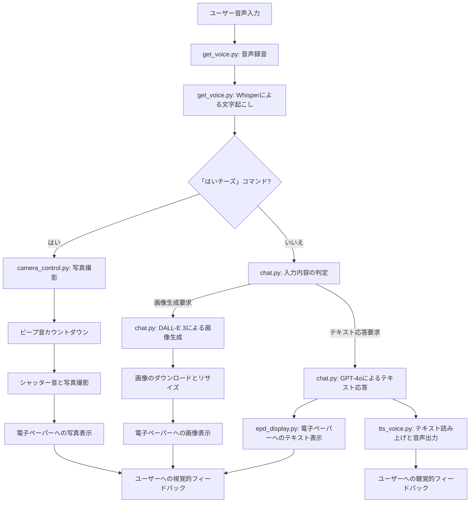

# auto_speaker

このプロジェクトは、Raspberry Piを使用した音声対話システムで、以下の機能を備えている。

*   音声を録音してOpenAI Whisper APIでテキストに変換
*   OpenAIのGPT-4を使用したテキスト応答生成
*   DALL-E 3による画像生成機能
*   電子ペーパーディスプレイ（EPD）への出力表示
*   テキスト読み上げAPIを用いた音声合成
*   生成画像の自動保存機能（入力文字列と日付情報をファイル名に使用）
*   「はいチーズ」音声コマンドによる写真撮影・表示機能
*   カウントダウンと撮影タイミングのビープ音フィードバック

## システム概要

このシステムは、ユーザーの音声入力を受け取り、その内容に基づいてテキスト応答や画像生成を行い、電子ペーパーディスプレイに表示すると同時に音声で読み上げる機能を持つ。特徴的なのは、応答が大阪弁のキャラクター（おばちゃん）として返されることである。

## プロジェクト構成

### ディレクトリ構造
```
auto_speaker/
├── api/                  # API関連のモジュール
│   ├── __init__.py
│   ├── chat.py           # OpenAI GPT/DALL-E APIとの通信
│   └── tts_voice.py      # テキスト読み上げ機能
├── camera/               # カメラ関連のモジュール
│   ├── __init__.py
│   └── camera_control.py # カメラ制御機能
├── display/              # ディスプレイ関連のモジュール
│   ├── __init__.py
│   ├── epd7in5_V2.py     # 7.5インチ電子ペーパー制御ライブラリ
│   ├── epd_display.py    # テキスト表示機能
│   └── epdconfig.py      # 電子ペーパー設定
├── voice/                # 音声処理関連のモジュール
│   ├── __init__.py
│   └── get_voice.py      # 音声録音と文字起こし
├── generated_images/     # 生成された画像の保存ディレクトリ
├── photos/               # 撮影された写真の保存ディレクトリ
├── sounds/               # 音声フィードバック用のサウンドファイル
├── __init__.py
├── main.py               # メインプログラム
├── epd_reset.py          # 電子ペーパーのリセット用スクリプト
└── README.md             # このファイル
```

### 主要コンポーネントの詳細

#### メインプログラム (`main.py`)
- システム全体の実行フローを制御
- 各モジュールを連携させて、音声入力から応答出力までの一連の処理を実行
- 「はいチーズ」音声コマンドの検出と写真撮影機能の起動
- 画像生成要求とテキスト応答要求を適切に振り分け

#### API関連 (`api/`)
- `chat.py`
  - OpenAI GPT-4o-miniを使用したテキスト応答生成
  - DALL-E 3を使用した画像生成
  - ユーザー入力が画像生成要求かテキスト応答要求かを判定
  - 画像のダウンロードとリサイズ処理
  - 電子ペーパーへの画像表示

- `tts_voice.py`
  - OpenAI TTS APIを使用したテキスト読み上げ
  - 生成された音声の再生
  - 音声ファイル(response.mp3/response.wav)をsoundsディレクトリに保存

#### カメラ関連 (`camera/`)
- `camera_control.py`
  - Raspberry Pi カメラでの写真撮影制御
  - カウントダウンとシャッタータイミングのビープ音生成
  - 撮影した写真の保存と電子ペーパーへの表示機能
  - カウントダウン数字とシャッター音の音声フィードバック

#### ディスプレイ関連 (`display/`)
- `epd_display.py`
  - 電子ペーパーにテキストを表示する機能
  - 日本語フォントの使用と適切なテキストレンダリング
  - テキストの折り返しと配置の調整

- `epd7in5_V2.py` / `epdconfig.py`
  - 7.5インチ電子ペーパー（800×480ピクセル）の制御ライブラリ
  - ハードウェア固有の設定とドライバー
  - GPIOリソース管理とエラーハンドリング機能

#### 音声処理関連 (`voice/`)
- `get_voice.py`
  - マイクからの音声録音
  - 録音開始と終了の自動検出（音量しきい値による）
  - OpenAI Whisper APIを使用した高速・高精度な音声テキスト変換
  - 日本語認識に最適化された設定
  - 処理時間の計測と表示機能
  - 録音ファイル(input.wav)をsoundsディレクトリに保存

## システムフローチャート



## 機能詳細

### 1. 音声録音と文字起こし
- マイクから音声を録音し、WAVファイルとして保存（`sounds/input.wav`）
- 録音開始と終了の自動検出（音量しきい値による）
- OpenAI Whisper APIを使用した高速・高精度な音声テキスト変換
- 日本語認識に最適化された設定
- 処理時間の計測と表示機能

### 2. テキスト応答生成
- GPT-4o-miniを使用したテキスト応答生成
- 大阪弁のおばちゃんキャラクターとしての応答
- ユーザーの質問や要求に対する自然な対話
- 生成された音声応答ファイルをsoundsディレクトリに保存（`sounds/response.mp3`、`sounds/response.wav`）

### 3. 画像生成
- ユーザーからの画像生成要求の検出
- DALL-E 3を使用した高品質な画像生成
- 電子ペーパーの解像度（800×480）に最適化
- 生成された画像を日付と入力テキストをファイル名にして自動保存
  - 保存先：プロジェクトルート直下の `generated_images` ディレクトリ
  - ファイル名形式：`YYYYMMDD_HHMMSS_入力テキスト.png`
  - ファイル名に使用できない文字は自動的に除去または置換

### 4. カメラ撮影機能
- 「はい、ちーず」などの音声コマンドで写真撮影を起動
- 撮影前のカウントダウン（3,2,1）のビープ音フィードバック：
  - 各数字にタイミングを合わせたビープ音
  - 一定間隔でのカウントダウン通知
- 撮影直前に短いビープ音を2回鳴らして準備を通知
- シャッター音で撮影タイミングを通知
- テキスト情報が見えない場合でも音だけで撮影タイミングがわかる
- 撮影した写真を電子ペーパーディスプレイに表示
- 写真を日時情報付きでphotoディレクトリに自動保存

### 5. テキスト・画像の表示
- 7.5インチ電子ペーパーディスプレイへの出力
- テキスト表示時の適切なフォントサイズと行折り返し
- 画像表示時の最適なリサイズと調整
- 白黒2値での表示に最適化

### 6. テキスト読み上げ
- OpenAI TTS APIを使用した自然な音声合成
- 大阪弁の特徴を活かした音声出力
- スピーカーを通じての音声再生

## 実行環境とバージョン

*   ハードウェア: Raspberry Pi 4 Model B
*   OS: Linux raspberrypi 6.6.74+rpt-rpi-v8 #1 SMP PREEMPT Debian 1:6.6.74-1+rpt1 (2025-01-27) aarch64 GNU/Linux
*   Python: 3.11.2
*   カメラ: Raspberry Pi Camera Module 3（または互換カメラ）
*   ディスプレイ: 7.5インチ電子ペーパー（800×480ピクセル）
*   マイク: USB接続または3.5mmジャック接続のマイク
*   スピーカー: USB接続または3.5mmジャック接続のスピーカー

## 依存関係

- OpenAI関連
  - `openai` (1.65.4): GPT-4、Whisper、TTSサービスにアクセスするためのクライアント
  - OpenAI API Key（環境変数 `OPENAI_API_KEY` に設定）

- 音声処理関連
  - `sounddevice` (0.5.1): マイクからの音声録音
  - `numpy` (1.26.4): 音声データの数値処理
  - `wave`: WAVファイルの操作
  - `pydub` (0.25.1): MP3ファイルの操作
  - `simpleaudio` (1.0.4): 音声ファイルの再生とフィードバック音の生成

- カメラ関連
  - `picamera2`: Raspberry Pi カメラモジュールを制御するためのライブラリ
  - `PIL (Pillow)` (10.3.0): 撮影画像の処理とリサイズ

- 画像・表示関連
  - `PIL (Pillow)` (10.3.0): 画像処理と電子ペーパー表示
  - `requests` (2.32.3): 画像のダウンロード
  - `epd7in5_V2`: 電子ペーパーのドライバーライブラリ

## インストール方法

1. 必要なPythonパッケージのインストール:
   ```bash
   pip install openai==1.65.4 sounddevice==0.5.1 numpy==1.26.4 pydub==0.25.1 simpleaudio==1.0.4 pillow==10.3.0 requests==2.32.3
   ```

2. カメラモジュールのセットアップ:
   ```bash
   # Raspberry Pi カメラモジュールライブラリをインストール
   sudo apt-get update
   sudo apt-get install -y python3-picamera2
   
   # カメラインターフェースを有効化
   sudo raspi-config
   # インターフェースオプション -> カメラ -> 有効化を選択
   ```

3. 環境変数の設定:
   ```bash
   export OPENAI_API_KEY="your_api_key_here"
   ```
   または、`.bashrc`や`.env`ファイルに追加

4. 電子ペーパーディスプレイのセットアップ:
   - Raspberry PiのSPIインターフェースを有効化
   - 電子ペーパーとRaspberry Piの接続は以下の配線表に従う:（詳細は[こちら](https://github.com/waveshareteam/e-Paper/tree/master/RaspberryPi_JetsonNano)）

   | 電子ペーパー（EPD） | Raspberry Pi（BCM番号） | 物理ピン | 機能                  |
   |-------------------|---------------------|--------|---------------------|
   | VCC               | 3.3V                | 1      | 電源（3.3V）          |
   | GND               | GND                 | 6      | グラウンド             |
   | DIN               | 10（SPI0_MOSI）     | 19     | SPIデータ出力          |
   | CLK               | 11（SPI0_SCK）      | 23     | SPIクロック            |
   | CS                | 8（SPI0_CS0）       | 24     | SPIチップセレクト       |
   | DC                | 25                  | 22     | データ/コマンド切り替え   |
   | RST               | 17                  | 11     | リセット               |
   | BUSY              | 24                  | 18     | ビジー信号（動作確認）    |

## 使用方法

1. システムの起動:
   ```bash
   python main.py
   ```

2. 音声入力:
   - 起動後、自動的に音声録音が開始される
   - 話し始めると自動的に検出され、録音が開始される
   - 話し終えると自動的に録音が停止し、処理が始まる

3. 「はいチーズ」コマンドで写真撮影:
   - 「はい、チーズ」と発声すると自動的に写真撮影モードが起動
   - カウントダウンのビープ音が鳴り（3, 2, 1）、撮影準備を知らせる
   - シャッター音の後に写真が撮影され、電子ペーパーに表示される
   - 撮影された写真は日時情報付きでphotosディレクトリに自動保存

4. 応答の受け取り:
   - テキスト応答の場合: 電子ペーパーに表示され、同時に音声で読み上げられる
   - 画像生成の場合: 生成された画像が電子ペーパーに表示され、同時に`generated_images`フォルダに保存される

5. 電子ペーパーのリセット（必要な場合）:
   ```bash
   python epd_reset.py
   ```

## トラブルシューティング

- **音声が認識されない場合:**
  - マイクの接続と設定を確認
  - `get_voice.py`の音量しきい値パラメータを調整

- **OpenAI APIエラー:**
  - APIキーが正しく設定されているか確認
  - インターネット接続を確認
  - APIの利用制限に達していないか確認
  - 音声ファイル形式が適切か確認（WAV形式、サンプルレート16kHz）

- **カメラが動作しない場合:**
  - `vcgencmd get_camera` コマンドでカメラが認識されているか確認
  - カメラケーブルの接続を確認（特に向きや固定状態）
  - `raspi-config` でカメラインターフェースが有効になっているか確認
  - カメラの赤色LEDが点灯しているか確認（撮影時）
  - `ls -l /dev/video*` で video0 デバイスが存在するか確認
  - 権限の問題の場合は `sudo usermod -a -G video $USER` でユーザーをvideoグループに追加

- **lgpio.error: 'GPIO busy' エラーが発生する場合:**
  - `python epd_reset.py` を実行してGPIOリソースをリセット
  - `sudo killall pigpiod && sudo pigpiod` でpigpiodプロセスを再起動
  - システムの再起動を試す

- **電子ペーパーの表示問題:**
  - `epd_reset.py`を実行して電子ペーパーをリセット
  - ハードウェア接続を確認
  - SPIインターフェースが有効化されているか確認

- **音声出力の問題:**
  - スピーカーの接続と音量設定を確認
  - `simpleaudio`のインストールと設定を確認

## 拡張と改良のアイデア

- 連続対話モードの実装
- 複数のキャラクター/ペルソナの追加
- ウェブインターフェースによる遠隔操作
- バッテリー駆動と省電力モードの最適化
- 音声認識の精度向上（ノイズキャンセリングなど）
- カメラ機能の拡張（タイマー撮影、効果適用、顔認識など）
- 撮影画像をAIで分析して説明するモード

## ライセンス

LICENSEファイルに記載されているライセンスの下で提供

## 謝辞

- OpenAI: GPT-4、DALL-E、Whisperの提供
- Waveshare: [電子ペーパーディスプレイのドライバーライブラリ](https://github.com/waveshareteam/e-Paper/tree/master)
